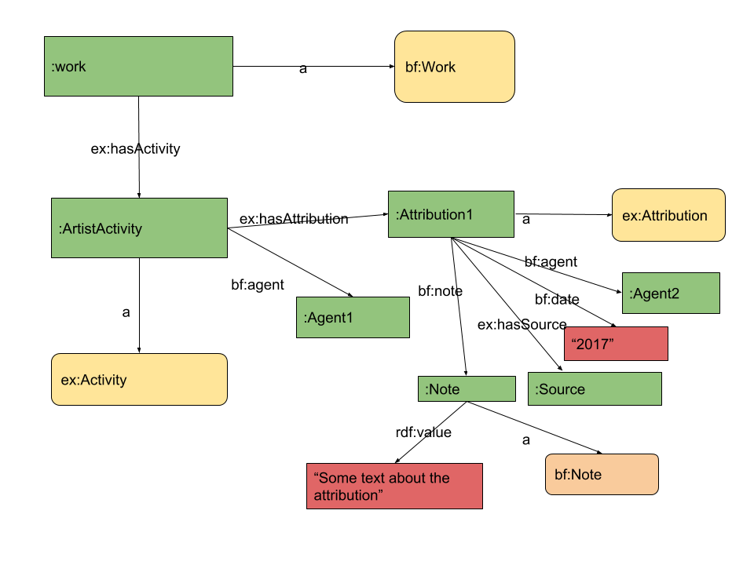

Attribution
===============
ArtFrame, March 16, 2018, updated June 28, 2018

**Table of Contents**
- [Background](#background)
- [Recommendations for Moving Forward](#recommendations)
  - [Recommended Classes](#classes)
  - [Recommended Properties](#properties)
- [RDF Sample](#rdf)
- [Diagram](#diagram)

<a name="background">Background</a>
-----------
The attribution of a work to a specific creator is an important concept in art cataloging. An attribution can be defined as the 
activity of “ascribing a work to a particular artist or school of artists” [*aat*](http://www.getty.edu/vow/AATFullDisplay?find=attribution&logic=AND&note=&english=N&prev_page=1&subjectid=300056109).
This attribution may change over time as new research becomes available. In the MARC 21 standard this has so far been handled by 
adding subfield j (attribution qualifier) to the 1xx field in the bibliographic record. The MARC Relator Terms contain “Attributed 
name” (http://id.loc.gov/vocabulary/relators/att) for use in this subfield. However, the ArtFrame group felt that attributions 
behaves somewhat differently from other relators such as artist or author. BIBFRAME and the conversion specifications made public 
by the Library of Congress have not yet addressed this concept.

<a name="recommendations">Recommendations for Moving Forward</a>
---------------------------

This model proposes a new object property (arm:hasAttribution) and a class (arm:Attribution). Necessary information such as dates of 
the attribution, agent responsible for making the attribution, and/or the source on which this attribution is based can be associated 
directly with this Attribution node. Complex information that cannot easily be expressed in structured form should be recorded in 
a bf:Note.

<a name="classes">Recommended Classes</a>
-----------

**arm:Attribution**
> - **Label:** Attribution
> - **IRI:** https://w3id.org/arm/core/ontology/0.1/Attribution
> - **Definition:** The ascribing of an activity to a particular agent or agents. This attribution may change over time based on new evidence.  
> - **Scope note:** The Attribution is directly related to an Activity, and carries additional data about the agent, source, date, etc. of the attribution.
> - **Example:** The activity of creating an artwork is ascribed to a particular artist.

**activity:Activity**
> - **Label:** Activity
> - **IRI:** https://w3id.org/arm/activity/ontology/0.1/Activity
> - **Definition:** An activity or contribution by a single agent that affects or alters the existence or state of a resource.

**activity:ArtistActivity**
> - **Label:** Artist
> - **IRI:** https://w3id.org/arm/activity/ontology/0.1/ArtistActivity
> - **Definition:** The activity of creating a work by conceiving, and implementing, an original graphic design, drawing, 
                    painting, etc. For book illustrators, prefer IllustratorActivity.
> - **Subclass of:** activity:Activity
> - **Editorial note:** Future work: consider more formal alignment between the class and corresponding MARC relator.
> - **Scope note:** This class is derived from the MARC relator: http://id.loc.gov/vocabulary/relators/art.

*NB:* activity:ArtistActivity is listed as one example of an activity that can be associated with ex:hasAttribution. Other activities 
may be used as provided by the ontology.

**bf:Agent**
> - **Label:** Agent
> - **IRI:** http://id.loc.gov/ontologies/bibframe/Agent
> - **Definition:** Entity having a role in a resource, such as a person or organization.

**bf:Note**
> - **Label:** Note
> - **IRI:** http://id.loc.gov/ontologies/bibframe/Note
> - **Definition:** Information, usually in textual form, on attributes of a resource or some aspect of a resource.

<a name="properties">Recommended Properties</a>
-----------

**arm:hasAttribution (object property)**
> - **Label:** has attribution
> - **IRI:** https://w3id.org/arm/core/ontology/0.1/hasAttribution
> - **Definition:** Used to attribute an Activity, such as ArtistActivity, to a particular agent or agents: relates the Activity (or other resource) to an Attribution resource, which carries information about the agent, source, date, etc. of the attribution.
> - **Range:* arm:Attribution
> - **Inverse:** arm:isAttributionOf

**arm:isAttributionOf (object property)**
> - **Label:** is attribution of
> - **IRI:** https://w3id.org/arm/core/ontology/0.1/isAttributionOf
> - **Definition:** Used to attribute an Activity, such as ArtistActivity, to a particular agent or agents: relates an Attribution resource to the Activity (or other resource), where the Attribution carries information about the agent, source, date, etc. of the attribution. 
> - **Domain:* arm:Attribution
> - **Inverse:** arm:hasAttribution

**bf:agent (object property)**
> - **Label:** Associated agent
> - **IRI:** http://id.loc.gov/ontologies/bibframe/agent
> - **Definition:** Entity associated with a resource or element of description, such as the name of the entity responsible for 
                    the content or of the publication, printing, distribution, issue, release or production of a resource.
> - **Comment** Used with Unspecified.
> - **Range:** bf:Agent

**activity:hasActivity (object property)**
> - **Label:** has activity
> - **IRI:** https://w3id.org/arm/activity/ontology/0.1/hasActivity
> - **Definition:** Relates this resource to an activity or contribution by a single agent that affects or alters its existence 
                    or state.
> - **Range** activity:Activity
> - **Inverse:** activity:isActivityOf

**activity:isActivityOf (object property)**
> - **Label:** is activity of
> - **IRI:** https://w3id.org/arm/activity/ontology/0.1/isActivityOf
> - **Definition:** Relates an activity to the affected resource.
> - **Domain:* activity:Activity
> - **Inverse:** activity:hasActivity

**bf:date (object property)**
> - **Label:** Date
> - **IRI:** http://id.loc.gov/ontologies/bibframe/date
> - **Definition:** Date designation associated with a resource or element of description, such as date of title variation; 
                    year a degree was awarded; date associated with the publication, printing, distribution, issue, release or 
                    production of a resource. May be date typed.
> - **Comment** Used with Unspecified.

**arm:hasSource (object property)**
> - **Label:** has source
> - **IRI:** https://w3id.org/arm/core/ontology/0.1/hasSource
> - **Definition:** Relates this resource to the source from which it was derived.
> - **Comment:** Has general applicability to many types of sources and resources.
> - **Inverse:** arm:isSourceOf

**arm:isSourceOf (object property)**
> - **Label:** is source of
> - **IRI:** "https://w3id.org/arm/core/ontology/0.1/isSourceOf
> - **Definition:** Relates this resource to a resource of which it is the source.
> - **Comment:** Has general applicability to many types of sources and resources.
> - **Inverse:** arm:hasSource

**bf:note (object property)**
> - **Label:** Note
> - **IRI:** http://id.loc.gov/ontologies/bibframe/note
> - **Definition:** General textual information relating to a resource, such as Information about a specific copy of a resource 
                    or information about a particular attribute of a resource.
> - **Comment:** Used with Unspecified.
> - **Range:** bf:Note

<a name="rdf">RDF Sample</a>
-----------

```
:work a bf:Work ;
    activity:hasActivity :artistActivity .

 :artistActivity a activity:ArtistActivity ;
      bf:agent :artist ;
      arm:hasAttribution :attribution .
:attribution a arm:Attribution ;
    bf:agent :attributor ;
    bf:date "2017" ;
    arm:hasSource :source ;
    bf:note :note .

:note1 a bf:Note ;
    rdf:value "Some text about the attribution" .

```
<a name="diagram">Diagram</a>
-----------

